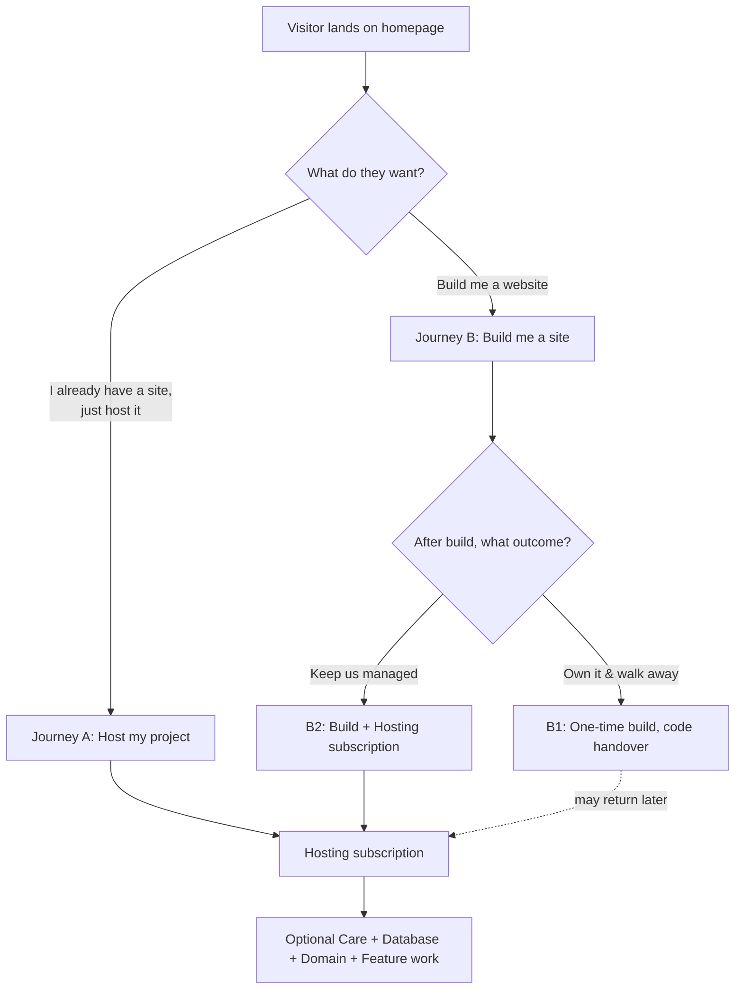
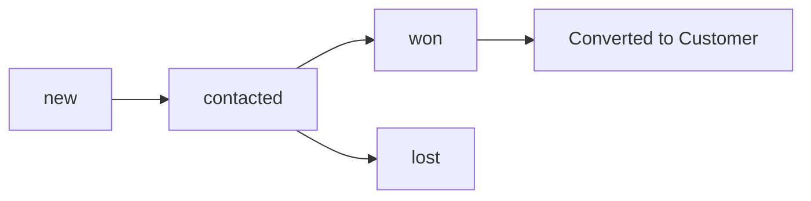
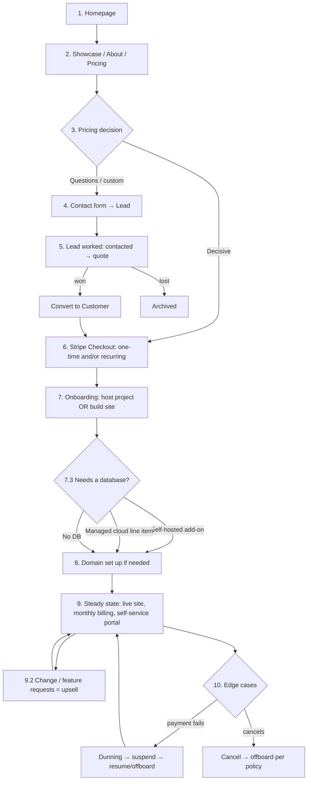

# TheWebsiteForge — The Customer Experience (The Vision)

> **What this is:** A complete, scenario-by-scenario walkthrough of _every_ path a customer
> can take with TheWebsiteForge — from the first second they land on the homepage, through
> becoming a lead, getting a quote, paying, onboarding, and living as a long-term hosted
> customer.
>
> **Assumption:** This describes the experience **after everything in
> [TheWebsiteForgePlan.md](TheWebsiteForgePlan.md) is built and live** — Stripe Checkout +
> Customer Portal, transactional email (Resend), the customer account area, admin write
> actions, and domain tracking are all working.
>
> **How to read it:** This is the _vision_ — the ideal end-to-end journey. Each section is a
> real moment in the customer's life with you, what they see, what happens behind the
> scenes (your admin + the system), and what email/automation fires.

---

## 0. The Two Doors (mental model)

Every customer enters through one of two doors, but both lead to the **same recurring
engine** (hosting + database + care + domains):

- **Journey A — "Host my existing project."** They bring a finished site; you host it.
- **Journey B — "Build me a website."** You build it; then they choose:
  - **B1 – Own it:** pay once, get the code, walk away.
  - **B2 – Managed:** pay the build + ongoing hosting (the ideal recurring customer).

Keep this map in mind — every scenario below is a branch of it.

---

## 1. First Contact — The Homepage (Awareness)

**The moment:** A stranger arrives at `thewebsiteforge.com`. They might be a small-business
owner with no site, a developer who built something and needs hosting, or someone
comparison-shopping agencies.

**What they see:**

- A polished, animated hero that states the offer in one line ("We build, host, and look
  after your website — so you don't have to").
- Immediate clarity on the **two doors**: _"Need a site built?"_ vs _"Already have one?
  We'll host it."_
- Social proof: showcase projects, a logo marquee, stats strip, testimonials.
- Clear primary CTAs: **"See pricing"**, **"Start a project"**, **"Get a quote"**.

**The emotional goal:** in 10 seconds they think _"these people are legit, and they can
solve my specific problem."_

**Behind the scenes:** nothing yet — this is pure marketing. No account, no data captured
until they act.

**Where they can go next:**

- → **Pricing** (price-shoppers)
- → **Showcase** (proof-seekers)
- → **About** (trust-builders)
- → **Contact / Get a quote** (ready-to-talk)
- → **Subscribe / Get started** directly on a plan (decisive self-serve buyers)

---

## 2. Exploration — Building Confidence

Before committing, most customers browse. Each page answers a specific doubt:

| Page                                                     | The doubt it kills                          | What they do next                                  |
| -------------------------------------------------------- | ------------------------------------------- | -------------------------------------------------- |
| **Showcase**                                             | "Can they actually build good sites?"       | Click into a project → impressed → Pricing/Contact |
| **About**                                                | "Who are these people? Will they vanish?"   | Read story → trust ↑ → Contact                     |
| **Pricing**                                              | "Can I afford this? What exactly do I get?" | Pick a path (build vs host) → CTA                  |
| **Legal** (Terms / Hosting Agreement / Refund / Privacy) | "Am I locked in? What are the rules?"       | Reassured → proceed                                |

**Behind the scenes:** still anonymous. (Optional future: lightweight analytics so you can
see which pages convert.)

---

## 3. The Pricing Page — The Decision Fork

This is where the customer self-selects their journey. The page presents the streams
clearly (Build / Hosting / Database / Care / Domains).
**Three customer reactions, three paths:**

### 3.1 "I know exactly what I want" → Self-serve checkout

A decisive customer (e.g. someone who just needs **Dynamic Hosting** for a site they built)
clicks **"Subscribe"** / **"Get started"** on a plan.

→ Jumps straight to **[§6 Checkout](#6-checkout--taking-the-money-stripe-hosted)**.

### 3.2 "I have questions / I need something custom" → Lead/quote

A customer wanting a **Custom build**, or unsure which hosting tier fits, clicks
**"Get a quote"** / **"Start a project"**.

→ Goes to **[§4 Becoming a Lead](#4-becoming-a-lead--the-contact-form)**.

### 3.3 "Just looking" → Leaves (for now)

They bounce. That's fine — the showcase and brand did their job; they may return. (Future:
a newsletter or retargeting could recapture them — out of scope for v1.)

---

## 4. Becoming a Lead — The Contact Form

**The moment:** The customer fills in the contact form on `/contact` (name, email, company,
budget, message). This is the **top of your sales pipeline**.

**What they experience:**

1. They submit the form.
2. **Instant on-screen confirmation:** _"Thanks — we've got your message and will reply
   within [X hours]."_
3. **Within seconds, a confirmation email lands** in their inbox (via Resend): branded,
   reassuring, sets the response-time expectation, maybe links to the showcase while they
   wait.

**Behind the scenes (the system):**

- The submission writes a row to the **`leads`** table (status `new`).
- A **"New lead" alert email** fires to you (`MAIL_ADMIN`) so you never miss one.
- The lead instantly appears in **Admin → Leads** with all their details.

**The customer's state:** they've raised their hand. They're now a **lead**, waiting to
hear from you.

---

## 5. The Lead → Quote Conversation (Your Sales Process)

**The moment:** You (admin) work the lead. This is partly human, partly system-tracked.

**The pipeline (visible in Admin → Leads):**

**Step by step:**

1. **You open the lead** in Admin → Leads, read their message and budget.
2. **You reach out** (email/call) to understand scope. You mark the lead **`contacted`**.
3. **You scope & quote:**
   - **For a fixed plan** (e.g. hosting tier): you point them to the right plan; they can
     self-checkout, or you send a payment link.
   - **For a custom build / feature work:** you prepare a **quote** (scope + price). You
     agree on it over email.
4. **Outcome:**
   - **They say yes → mark `won`** → **convert the lead into a `customer`** (one click in
     admin creates their `customers` record from the lead data).
   - **They say no / go quiet → mark `lost`** (kept for records, no further action).

**Behind the scenes:** every status change is logged (`audit_log`), so you have a paper
trail of how each deal progressed.

**The customer's state:** they've had a real conversation, received a clear quote, and
decided to proceed. Now they need to **pay**.

---

## 6. Checkout — Taking the Money (Stripe-hosted)

This is the conversion moment. **Two flavours**, both through **Stripe Checkout** (hosted —
no card details ever touch your site).

### 6.1 Recurring (Hosting / Care) — subscription checkout

**The moment:** The customer commits to an ongoing plan (e.g. Dynamic Hosting).

**What they experience:**

1. They click **"Subscribe"** (from pricing, or a link you sent).
2. They're redirected to a **clean Stripe-hosted Checkout page** showing the plan, price,
   and billing interval.
3. They enter their card; Stripe handles everything (3-D Secure, validation).
4. On success → redirected to your **"You're all set" success page**.

**Behind the scenes (automatic, via webhook):**

- Stripe fires `checkout.session.completed`.
- Your webhook creates/activates a **`subscriptions`** row (plan, amount, interval,
  `currentPeriodEnd`), upserts the **`customers`** row with their `stripeCustomerId`, and
  records the first **`invoice`** as `paid`.
- A **receipt email** is sent (Stripe's own, and/or your branded one).
- The customer immediately shows up in **Admin → Customers** and **Admin → Billing** with an
  active subscription contributing to your **MRR**.

### 6.2 One-time (Build / Feature work / Domain) — payment checkout

**The moment:** The customer pays a one-off (e.g. a build deposit or a quoted feature).

**What they experience:**

1. They click a **payment link** you generated (or a "Pay deposit" button).
2. Stripe Checkout in **one-time payment mode** — they pay once.
3. Success page → done.

**Behind the scenes:**

- Webhook records a **`invoice`** of type `build` / `feature` / `domain`, marked `paid`.
- Receipt email sent. It appears in Admin → Billing and the customer's history.

> **The magic:** from your side, you did almost nothing during payment — Stripe + the
> webhook did the work, and your dashboard updated itself. The customer had a frictionless,
> trustworthy checkout.

---

## 7. Onboarding — Turning a Payment into a Live Relationship

Payment is not the finish line — **onboarding** is where you earn the recurring revenue.
The exact steps depend on which journey they took.

### 7.1 Journey A — "Host my existing project"

**The moment:** They've paid for hosting; now you need their site.

**The experience:**

1. **Onboarding email** (triggered after payment): _"Welcome! Here's how to send us your
   site."_ It contains an **intake checklist**:
   - How to deliver the project (Git repo link or zip upload).
   - What stack it is (static vs Node), any env vars/secrets, build commands.
   - Their domain situation (they have one / they need one).
2. They reply with the project + details.
3. **You deploy it** to your VPS, point/connect the domain, run checks.
4. **"You're live" email** with their live URL.

**Behind the scenes:**

- You create a **`sites`** row (origin `brought`, status `draft` → `live`), linked to the
  customer.
- If they need a domain → **[§8 Domains](#8-domains--the-pass-through-service)**.
- Site now visible in **Admin → Sites**.

### 7.2 Journey B — "Build me a website"

**The moment:** They've paid the build (or deposit); now you build.

**The experience:**

1. **Kickoff email:** intake for the build — brand assets, content, references, the pages
   they want, any integrations.
2. **You build it.** Share progress/preview links. Use the agreed revision allowance.
3. **Approval + final payment** (if a deposit model was used, the balance is invoiced now via
   a Stripe payment link).
4. **The fork — their outcome choice:**
   - **B1 – Own it:** you **hand over the code/site**, transfer the domain to them if they
     want, and the relationship (optionally) ends. _No recurring obligation._
   - **B2 – Managed:** they start a **Hosting subscription** ([§6.1](#61-recurring-hosting--care--subscription-checkout)); you keep
     hosting + maintaining it. _This is the ideal outcome._

**Behind the scenes:**

- A **`sites`** row (origin `built`), status moves `draft` → `live`.
- B1: optionally mark status `offboarded` after handover (they own it).
- B2: a `subscriptions` row keeps them in the recurring engine.

### 7.3 The Database Decision (App-tier sites only)

**The moment:** The customer's site needs a **database** — a store, a dashboard, a
DB-backed app. This applies to **App-tier** customers (Journey A or B). It's decided at
order time and shapes both their bill and how their data is hosted.

**You present two options (per plan §3.2.1):**

| Option                     | What it is                                                                                                             | How it's billed                                                                                   | Best for                                                                                                       |
| -------------------------- | ---------------------------------------------------------------------------------------------------------------------- | ------------------------------------------------------------------------------------------------- | -------------------------------------------------------------------------------------------------------------- |
| **Self-hosted (default)**  | Their database runs on **your VPS**, sold as a **fixed-size add-on** (Small / Medium / Large with hard storage quotas) | A **predictable flat add-on** — a recurring line on their subscription                            | Most customers; predictable cost, safe margin for you                                                          |
| **Managed cloud (opt-in)** | A managed DB (GCP Cloud SQL, AWS RDS, Neon, etc.) you set up on their behalf                                           | **Provider cost + markup**, as its **own visible monthly line item** that can move month to month | Customers needing high availability, failover, point-in-time restore, or compliance a single VPS can't promise |

**What the customer experiences:**

1. During scoping/checkout you explain the trade-off in plain language: _"Self-hosted is
   simpler and cheaper with a fixed size; managed cloud costs more and can vary, but gives
   you enterprise-grade resilience."_
2. They **choose**. Most pick self-hosted.
3. For **managed cloud**, they explicitly accept that the line item can change as their
   usage (and your provider bill) grows — no surprises later.

**Behind the scenes:**

- The choice is recorded on their **`sites`** row via the **`dbHosting`** field
  (`self_hosted` or `managed`; `none` for sites with no DB).
- **Self-hosted:** the DB add-on rides on their hosting subscription. Each tier has a **hard
  quota** — crossing it triggers an **upgrade conversation**, never a silent overage.
- **Managed cloud:** billed as a **separate `subscription`/`invoice` line** so you can
  re-price it painlessly as their usage grows, without touching their hosting price.
- You watch VPS headroom centrally (**Admin → Sites**) so you know when to migrate a growing
  customer from self-hosted to managed — _before_ you run out of room.

**The growth path:** a customer can **start self-hosted and graduate to managed cloud** when
they outgrow the VPS. You migrate their data and switch them to the pass-through line item —
a natural upsell, not a disruption.

---

## 8. Domains — The Pass-through Service

**The moment:** At any point (during onboarding or later), a customer needs a domain.

**Two cases:**

### 8.1 They already own a domain

- They give you the domain; you **point DNS** to their site (via Cloudflare).
- A **`domains`** row tracks it (registrar, expiry) so you can monitor it.

### 8.2 They need you to buy/manage one

- You register it on **Cloudflare Registrar**, **with the customer as the legal registrant
  from day one** (no ownership disputes — see plan §9.1).
- You bill it as **registrar cost + a flat annual management fee** (a one-time `invoice` of
  type `domain`, or rolled into their plan).
- A **`domains`** row records expiry + auto-renew; the system **alerts you 30 days before
  expiry** so nothing lapses.

**The customer's experience:** they never think about DNS, renewals, or technical domain
admin — it "just works," and they legally own their domain. On request, you hand over full
control.

---

## 9. The Steady State — Life as a Hosted Customer

This is the recurring relationship — months and years of quiet, reliable value. Most of the
time the customer does nothing and the system hums.

**What "normal" looks like:**

- Their site is live, monitored, backed up (per their tier).
- Each month, **Stripe auto-charges** the subscription. A **receipt email** arrives. Their
  `currentPeriodEnd` rolls forward. Your MRR is steady.
- Small change requests (text edits, image swaps) within their **free Hosting allowance**
  are handled quickly.

### 9.1 The customer's self-service: the Account area + Stripe Portal

At any time, the customer can **sign in** (Google) to their **account area** and:

- See their **sites** and status (live / suspended).
- See their **current plan** and next renewal date.
- Click **"Manage billing"** → the **Stripe Customer Portal** (hosted), where they can:
  - update their card,
  - download invoices/receipts,
  - cancel or change their plan.
- **Submit a change/feature request** through a simple form.

**Why this matters:** it cuts your support load ("where's my invoice?"), and lets customers
fix expired cards themselves — which **reduces involuntary churn**.

### 9.2 Change & feature requests (upsell engine)

**The moment:** The customer wants something bigger — a new page, a feature, a redesign.

**The flow:**

1. They submit a **change request** (via the account area or email).
2. You scope it and send a **quote** (these are _not_ in the free allowance).
3. They approve → you send a **Stripe one-time payment link** → they pay → you build it.
4. Recorded as a `feature` invoice against their site.

This is where a hosted customer grows in value over time.

---

## 10. The Edge Cases — When Things Go Sideways

A finished product handles the unhappy paths gracefully, not just the happy one.

### 10.1 Payment fails (the big one)

**The moment:** Their card expires or is declined at renewal.

**The flow (automatic):**

1. Stripe fires `invoice.payment_failed`; webhook marks the subscription **`past_due`** and
   the invoice **`failed`**.
2. **Dunning email** goes out: _"We couldn't process your payment — update your card to keep
   your site online,"_ with a link to the Stripe portal.
3. Stripe retries automatically over several days.
4. **If still unpaid after the grace period** (e.g. 7 days, per plan §9): you **suspend** the
   site (status `suspended`) — it shows a holding page, not their content.
5. **If they pay:** webhook flips it back to `active`, you **resume** the site. Crisis over.
6. **If they never pay:** after N days you **offboard** (status `offboarded`) per the
   Hosting Agreement.

**The customer's experience:** clear warnings, an easy self-fix, and no nasty surprises —
the rules were in the Hosting Agreement they accepted.

### 10.2 They want to cancel

- They cancel in the **Stripe portal** (or ask you).
- Subscription goes `canceled` at period end (they keep service until then).
- Offboarding follows the agreed policy: what they get (code export? data dump? domain
  transfer-out?) depends on B1 vs B2 terms.

### 10.3 They want to leave / transfer their domain out

- You hand over the Cloudflare zone or initiate a transfer-out (mind the **60-day ICANN
  transfer lock**, set as an expectation up front — plan §9.1).
- Since they were the registrant all along, this is a clean administrative handoff.

### 10.4 A lead goes cold / a quote is rejected

- Marked `lost` in admin. No further automation. Kept for records (and possible future
  re-engagement).

### 10.5 Abuse / prohibited content

- Governed by the **Acceptable Use Policy** in the Hosting Agreement — you can suspend with
  cause.

### 10.6 They outgrow their database quota

- A **self-hosted DB add-on** customer crosses their tier's storage quota.
- The system flags it (you watch headroom in **Admin → Sites**); you start an **upgrade
  conversation** — bump them to the next size tier, or **migrate them to managed cloud** if
  they've outgrown the VPS entirely.
- Never a silent overage bill — always a deliberate upgrade (plan §3.2.1).

---

## 11. The Full Lifecycle — One Picture

---

## 12. The Vision in One Paragraph

A stranger lands on a homepage that instantly tells them you can **build, host, and look
after** their website. They either **buy a plan in two clicks** (Stripe-hosted, frictionless)
or **raise their hand via the contact form** — which instantly emails them a confirmation and
alerts you. You work the lead through a clean pipeline, send a quote, and on "yes" convert
them to a customer with a single click. They pay through Stripe; your dashboard updates
itself via webhooks; receipts and onboarding emails go out automatically. You either **host
the site they bring** or **build them a new one**, optionally registering their domain (which
they legally own from day one). Then they settle into a **quiet, profitable recurring
relationship**: the site stays live and backed up, Stripe bills them monthly, and they
self-serve invoices and card updates through the Stripe portal — only coming back to you to
**buy more** (features, pages, redesigns). When a card fails, the system warns them, retries,
and suspends gracefully per a Hosting Agreement they already accepted — so churn is rare and
never a surprise. **Every step is either automated or one click for you, and effortless and
trustworthy for them.**

---

_Companion to [TheWebsiteForgePlan.md](TheWebsiteForgePlan.md). Describes the intended
customer experience once the build plan is fully implemented._
