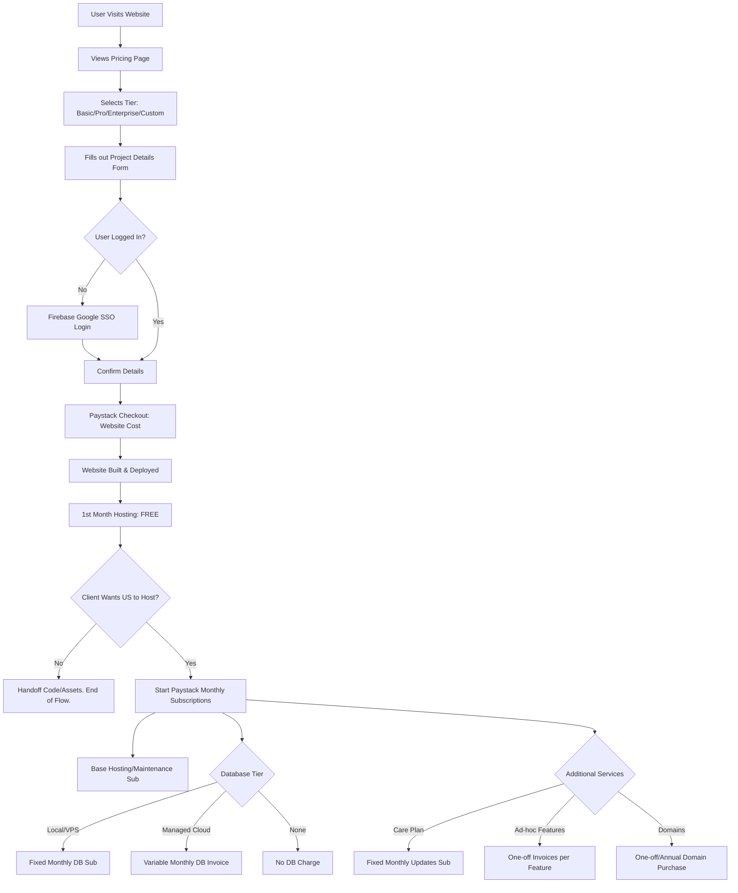
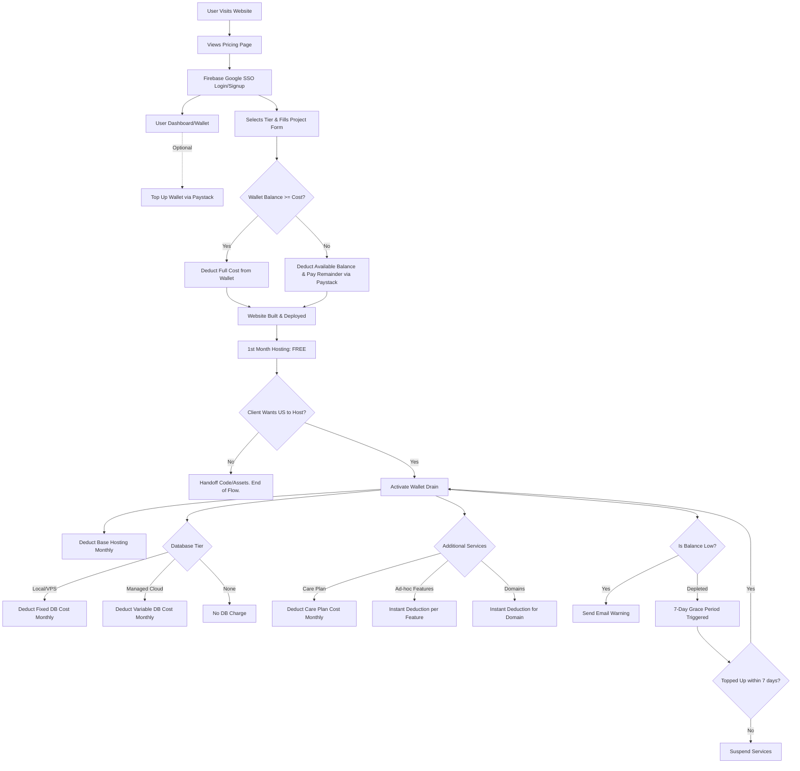

# Customer Experience & Flow: The Website Forge

This document outlines the two proposed customer experience flows for The Website Forge, detailing the step-by-step journey from initial visit to post-handoff maintenance.

---

## 1. The Generic Experience (Traditional Subscription Model)

This approach follows a standard SaaS/Agency billing model where customers pay upfront for the website and subscribe to recurring monthly plans for hosting, maintenance, and databases.

### Customer Flow
1. **Discovery & Browsing:** User lands on the website and navigates to the **Pricing** page.
2. **Tier Selection:** User views pricing tiers (Basic, Pro, Enterprise, Custom) and selects the desired package.
3. **Project Onboarding:** User fills out a detailed form outlining their website requirements and commission details.
4. **Authentication:** 
   * *Recommendation:* Prompt user to sign in using Firebase Google Auth SSO *after* they fill out the form. This reduces friction upfront (sunk cost fallacy—they've already spent time filling the form, making them more likely to sign in).
5. **Initial Checkout:** User is redirected to Paystack to complete the one-time payment for the website development.
6. **Development & Handoff:** Website is built. The first month of hosting is provided for **free**.
7. **Post-Handoff & Ongoing Services:**
   * **Hosting:** User signs up for a monthly recurring Paystack subscription for hosting, maintenance, and support.
   * **Database Needs:** 
     * *VPS Hosted:* Fixed monthly fee based on storage tier.
     * *Managed (AWS/GCP):* Variable monthly fee based on actual usage plus a small agency markup.
     * *No DB:* No additional charge.
   * **Ad-Hoc Features:** Future feature requests are quoted and billed individually.
   * **Care Plans (Optional):** User can subscribe to a monthly care plan covering a set number of updates/feature requests per month.
   * **Self-Hosting (Optional):** User can opt to take the completed website and host it themselves (no ongoing fees).
   * **Domain Services:** Customers can purchase domains through us via individual one-off payments.

### Flow Diagram

---

## 2. The Unique Experience (Wallet & Balance Model)

This approach introduces a prepaid digital wallet system. Users top up their account balance, and all project costs, subscriptions, and variable fees are deducted from this balance.

### Customer Flow
1. **Discovery & Browsing:** User lands on the website and navigates to the **Pricing** page.
2. **Account Creation:** User registers/logs in via Firebase Google Auth SSO.
3. **Wallet Funding (Optional upfront):** User has a dashboard where they can top up their account balance (e.g., add $500 via Paystack).
4. **Tier Selection & Onboarding:** User selects a pricing tier and inputs their website requirements.
5. **Smart Checkout:** 
   * The app checks the user's wallet balance against the website development cost.
   * If `Balance >= Cost`: Funds are instantly deducted from the wallet.
   * If `Balance < Cost`: User pays the difference via Paystack (Split Payment).
6. **Development & Handoff:** Website is built. First month of hosting is **free**.
7. **Post-Handoff & Ongoing Services (Wallet Drain):**
   * Instead of Paystack charging the user's bank card monthly, all monthly costs (Hosting, DB costs, Care Plans) are directly deducted from the user's wallet balance.
   * **Financial Dashboard:** User sees their current balance, their "Monthly Burn Rate" (total of all recurring fees), and an estimated depletion date (e.g., "Your balance will last for 4 months").
   * **Grace Period:** If the balance runs out, the user gets a 7-day grace period with email warnings before services are paused.
   * **Ad-Hoc Features & Domains:** Can also be purchased instantly using the wallet balance.
   * **Self-Hosting (Optional):** User can pay the upfront cost for the website commission. We then hand off the codebase/assets so they can host it themselves, and they choose not to utilize any ongoing wallet-drain services.

### Flow Diagram

---

## Conclusion: Which Approach is Better?

**Recommendation: The Unique Experience (Wallet/Balance Model)**

Here are the primary reasons why the Wallet model outshines the Generic approach for this specific business model:

1. **Perfectly Handles Variable Costs:** Since you offer Managed Hosting (AWS/GCP) where the bill changes based on traffic/usage every month, traditional subscription billing via Paystack can be a nightmare to adjust dynamically. A wallet system effortlessly handles variable monthly deductions.

2. **Reduces Friction for Micro-transactions:** Whether a client needs a $15 domain or a $50 ad-hoc button color change, they don't have to pull out their credit card and face Paystack every single time. It's a 1-click deduction from their balance.
3. **Psychological Lock-in (Sunk Cost):** When users prepay and have a standing balance, they are much less likely to migrate their hosting away, because they already have "money in the bank" attached to your ecosystem.
4. **Eliminates Payment Fatigue:** Clients hate getting bombarded with multiple tiny invoices (one for hosting, one for DB, one for a domain). Combining everything into a single "Burn Rate" and letting them top up chunks of money (e.g., pay $500 once and forget about it for half a year) creates a premium, hassle-free customer experience.
5. **Fewer Processing Fees:** You pay transaction fees whenever Paystack processes a card. Having users top up $500 in one go incurs fewer percentage/flat-rate fees over time compared to processing $20 subscription charges over 25 separate months.

### Important Considerations / Questions for You
* **Refund Policy:** If a user tops up $500, uses $100, and wants to leave, do you refund the remaining $400? You will need strict Terms of Service regarding wallet refunds. 
Answer: Money topped up into the users account will be non refundable and their should be a warning before purchasing stating that it's non refundable. Additionally we may do refunds but only at our own leasure.
* **Accounting:** Revenue recognition becomes slightly more complex. From an accounting perspective, a Wallet Top-up is a *liability* until you actually provide the service and deduct it.

* **SSO Placement:** Asking users to sign in *after* they configure their website details (but right before payment) typically results in higher conversion rates. Let them get invested in the process first!
Answer: I agree lets implement this

Do you have any specific concerns about implementing the wallet system (e.g., Paystack integration complexities), or any distinct constraints surrounding refunds and digital wallets you want to discuss?